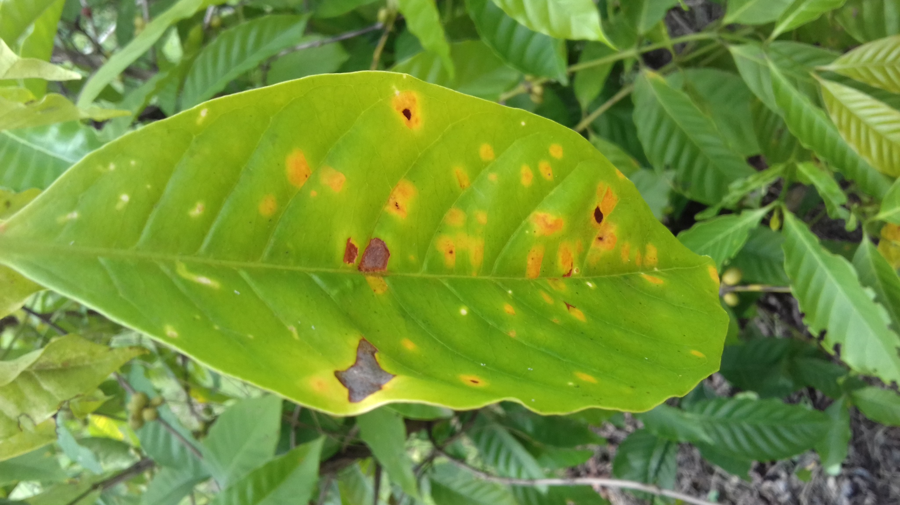

# A Comparative Analysis of Convolutional Neural Network Architectures for Coffee Leaf Rust Detection

<h1 align="center"><em>Hemileia vastatrix</em></h1>
## Coffee Leaf Rust Detection
Coffee is an essential part of many people's lives, providing morning energy and relaxation. However, coffee plants face threats, notably coffee leaf rust, caused by the fungus Hemileia vastatrix, which can severely affect coffee plant health and yield. This disease, spread by various means, can lead to significant losses of 30% to 50% in coffee production, impacting economies heavily reliant on coffee exports. Even minor declines in coffee yields or increased manufacturing costs have substantial consequences on various sectors, including coffee growers and banking institutions.

The task of identifying coffee leaf rust could be improved with the help of classical machine learning and deep learning methods.

In this work, We've created, tested, and compared several Convolutional Neural Network's (CNN) for identifying the said problem. The dataset used was obtained from data.mendeley.com. The dataset, named ["RoCoLe: A Robusta Coffee Leaf Images Dataset,"](https://data.mendeley.com/datasets/c5yvn32dzg/2) contains manually collected images from a coffee farm, including both healthy leaves and those with visible red mites and rust. For this study, only the images with coffee leaf rust were used while the images with red mites were excluded. This was done by a [python script] that loads the [csv file] containing the filename, binary.label (healthy or unhealthy), and multiclass.label (healthy, rust_level, mites) then iterates through the rows for the corresponding class.

The dataset comprises a total of 1393 images of Robusta coffee leaves, of which 1200 were selected for use in the study. These images were initially not uniform with regards to their dimensions. To address this, all selected images were resized to have a resolution of 96 dots per inch (dpi) and a dimension of 1152 x 2048 pixels. Moreover, to ensure a suitable sample size, the dataset was split into two classes: healthy coffee leaves and those with coffee leaf rust, and then divided into three separate sets in an 80%, 10%, and 10% ratio. The resulting training set contained 840 images, while the test and validation sets each contained 180 images. Here are the links to the datasets [with validation split](https://drive.google.com/drive/folders/15xsFnigBXLy60bALCLdqzz91LKXt6sRp?usp=sharing) and [no validation split](https://drive.google.com/drive/folders/1_hslCtlz6vHimf10FYzHmuYarR457JHp?usp=sharing).

## Model Training and Evaluation
Popular convolutional neural network (CNN) methods were compared to determine which model performs the best when it comes to detecting coffee leaf rust. The models will be assessed based on accuracy, training metrics, precision, recall, and F1 – score of the various CNN models.

The complete list of models trained are the following:
1. ResNet50
2. ResNet50V2
3. ResNet101
4. ResNet101V2
5. ResNet152
6. ResNet152V2
7. DenseNet121
8. DenseNet169
9. DenseNet201
10. EfficientNetB0
11. EfficientNetB1
12. EfficientNetB2
13. EfficientNetB3
14. EfficientNetB4
15. MobileNet
16. MobiletNetV2
17. MobiletNetV3Large
18. MobileNetV3Small
19. NASNetMobile
20. NASNetLarge
21. VGG16
22. VGG19
23. InceptionV3
24. Xception

## Inferencing
The top five (5) best performing models were evaluated and inferenced. Inferencing was done to determine if the model correctly detects if the coffee leaf is infected with rust or not.

<h4 align="center">Healthy</h4>

<h4 align="center">Rust</h4>

## Findings
Agriculture is a crucial sector in the Philippines, with coffee being a significant crop contributing to the country's income. Early detection of coffee leaf rust is essential for sustaining coffee farming. Different convolutional neural networks were used for coffee leaf rust detection. The top-performing models, DenseNet 169, achieved a validation accuracy of 95.56%. Other top models included ResNet50V2, Xception, ResNet101V2, and InceptionV3. Additionally, ResNet101V2 exhibited high accuracy, precision, recall, and F1-score, making it effective in detecting healthy and rust classes.

This work is documented and published in 2023 IEEE International Conference on Automatic Control and Intelligent Systems (I2CACIS)

A. K. Lelis, E. G. I. Ferriols, K. M. A.Vallesteros and J. A. B. Delmo, "A Comparative Analysis of Convolutional Neural Network Architectures for Coffee Leaf Rust Detection," 2023 IEEE International Conference on Automatic Control and Intelligent Systems (I2CACIS), Shah Alam, Malaysia, 2023, pp. 213-218, [doi: 10.1109/I2CACIS57635.2023.10193074.](https://ieeexplore.ieee.org/document/10193074)